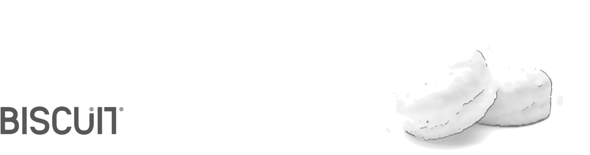

**[Biscuit](http://sblisesivdin.github.io/biscuit)** is a single-page responsive Jekyll theme. This is the simplest and still-good-looking Jekyll theme that you can find. 

## About me



  <h1>Research interests · latent space</h1>
  

    <canvas id="tsne-c" style="display:block;width:100%;"></canvas>
    

  


If you prefer to use GitHub Pages, you do not need to download it, upload files to a new repository, etc., just [fork](https://docs.github.com/en/get-starter/quickstart/fork-a-repo) and use it.

### Publications

* M. Sternik, R. Laarman-Quante, A. Drackert. Using k-Shot Prompting with Large k for the Automated Scoring of a German Written Elicited Imitation TEst.
German Written Elicited Imitation Test
* `index.md`               : Website page (for now, this page).
* `_includes/head.html`    : File to add custom code to `<head>` section.
* `_includes/scripts.html` : File to add custom code before `</body>`. You can change footer at here.
* `_sass` folder           : Related scss files can be found at this folder.
* `css/main.csss`          : Main scss file.
* `README.md`              : A simple readme file.

## CV

## Header 1
### Header 2
#### Header 3
**bold**
*italic*

> blockquotes

~~~python
import os,time
print ("Biscuit")
~~~

## Licence and Author Information

Biscuit is derived from the currently deprecated theme [Solo](http://github.com/chibicode/solo). The development of Biscuit is maintained by [Sefer Bora Lisesivdin](https://sblisesivdin.github.io).

Biscuit and the previous code, where Biscuit is derived, are distributed with [MIT license](https://github.com/sblisesivdin/biscuit/blob/gh-pages/LICENSE).
